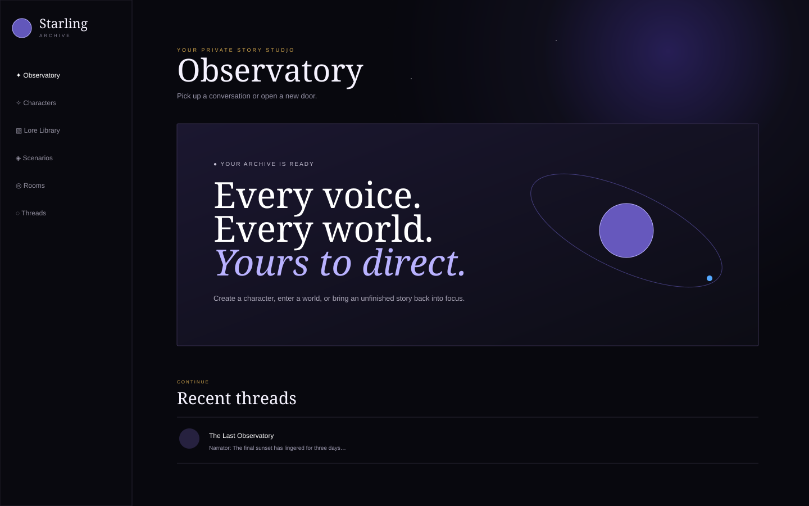

# Starling Archive

Starling Archive is a local-first Electron studio for creating AI characters, modular lore, directed group rooms, and explorable role-playing scenarios. Its characters and narrators use the local Codex CLI with `gpt-5.6-luna` at low reasoning.



## What it does

- Create characters with a name, detailed persona bio, default greeting, color, and connected lore.
- Build lore as small reusable modules with case-insensitive trigger words and phrases.
- Share a full lore module—or only selected modules—between any characters, scenarios, and rooms.
- Chat one-on-one with characters while preserving the recent thread and activated lore.
- Explore scenarios solo or alongside any selection of created characters.
- Direct rooms containing multiple characters and generate exactly one selected speaker at a time.
- Create, rename, resume, and delete conversation and role-playing threads.
- Store the archive locally and import or export a portable JSON backup.
- See the current Huntsville, Alabama time and weather at a glance.
- Download, verify, install, and restart into the latest GitHub release from Settings.
- Use the built-in About page as a complete field guide.

## Intelligence and privacy

Starling Archive calls your locally installed, authenticated Codex CLI. Every generation is ephemeral, read-only, and locked to:

```text
model: gpt-5.6-luna
reasoning effort: low
sandbox: read-only
approval policy: never
```

Characters, lore, scenarios, rooms, and threads remain in Electron's local app-data directory. For a generation, the app sends Codex a focused prompt assembled from the active persona, recent conversation, relevant scenario direction, cast, and only the lore modules whose triggers have appeared.

## Getting started

Requirements:

- Node.js 22 or newer
- The [Codex CLI](https://developers.openai.com/codex/cli/) installed and authenticated with `codex login`

```bash
npm install
npm run dev
```

If Starling cannot find Codex, open **Settings → Codex executable → Choose** and select it manually.

## Scripts

```bash
npm run dev            # Vite + Electron development mode
npm test               # Prompt and lore unit tests
npm run test:electron  # Production build plus Electron UI smoke test
npm run build          # Type-check and build the renderer
npm run dist:mac       # macOS DMG and ZIP
npm run dist:win       # Windows installer and portable app
```

Tagged releases (`v*`) trigger a GitHub Actions matrix that builds unsigned Windows and macOS downloads. Operating systems may warn about unsigned builds; production distribution should add code-signing credentials.

## Desktop updates

Open **Settings → Desktop updates → Update to latest release**. Starling selects the matching Apple Silicon, Intel Mac, or Windows installer from the latest GitHub release, verifies its published SHA-256 digest, installs it, and restarts. Automatic updates require a packaged copy of the app and an internet connection.

The weather widget requests only Huntsville's current conditions from Open-Meteo and keeps a short in-memory cache so the app remains usable during a temporary network interruption.

## Product research

The interaction model draws from two established patterns:

- Character.AI emphasizes character name, description, and greeting as the foundation of a character, with group chats supporting multiple AI characters and users in one room. See [Character.AI Quick Creation](https://book.character.ai/character-book/how-to-quick-creation), [Greeting](https://book.character.ai/character-book/character-attributes/greeting), and [Character Group Chat](https://blog.character.ai/new-feature-announcement-character-group-chat/).
- AI Dungeon treats scenarios as reusable adventure templates and Story Cards as context activated by trigger terms. See [What are Scenarios?](https://help.aidungeon.com/faq/what-are-scenarios), [What are Story Cards?](https://help.aidungeon.com/faq/story-cards), and [What are Adventures?](https://help.aidungeon.com/faq/what-are-adventures).

Starling's distinction is user-controlled pacing: rooms never start autonomous character-to-character loops. The user chooses the next speaker and receives one turn.

## Architecture

- Electron main process: secure windows, atomic local persistence, archive import/export, Codex subprocess isolation.
- Preload bridge: narrow typed IPC surface with context isolation and no renderer Node access.
- React + TypeScript renderer: all creation, library, thread, and chat workflows.
- Pure prompt engine: lore availability, trigger activation, cast context, and single-speaker prompt construction.
- Vitest and Playwright Core: unit coverage plus a packaged-renderer Electron smoke test.

## License

[MIT](LICENSE)
